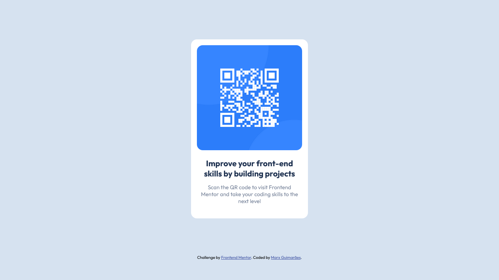

# Frontend Mentor - QR code component solution

This is a solution to the [QR code component challenge on Frontend Mentor](https://www.frontendmentor.io/challenges/qr-code-component-iux_sIO_H). Frontend Mentor challenges help you improve your coding skills by building realistic projects. 

## Table of contents

- [Overview](#overview)
  - [Screenshot](#screenshot)
  - [Links](#links)
- [My process](#my-process)
  - [Built with](#built-with)
  - [What I learned](#what-i-learned)
  - [Continued development](#continued-development)
  - [Useful resources](#useful-resources)
- [Author](#author)

## Overview

### Screenshot



### Links

- Solution URL: [Frontend Mentor](https://www.frontendmentor.io/solutions/qr-code-component-first-attempt-bBHQ0jUwxo)
- Live Site URL: [Github pages](https://marxguimaraes.github.io/qr-code-component/)

## My process

### Built with

- Semantic HTML5 markup
- CSS custom properties
- Flexbox

### What I learned

This project was an excellent opportunity to exercise the use of CSS Flex. I'm particularly proud of my method for placing the elements on the page since that's something that was pretty challenging when I first learned CSS.

```css
.wrapper {
  display: flex;
  flex-direction: column;
  flex-grow: 8;
  align-items: center;
  justify-content: center;
}
```

### Continued development

There isn't much to be added to this project since its has a pretty simple concept and purpose but I plan to add a link to my website when thats done.

### Useful resources

- [5 Tips to making responsive layouts the easy way](https://www.youtube.com/watch?v=VQraviuwbzU) - This video was of great help to touch up on a few concepts about responsive layouts using CSS.

## Author

- Website - TBD
- Frontend Mentor - [@marxguimaraes](https://www.frontendmentor.io/profile/marxguimaraes)
